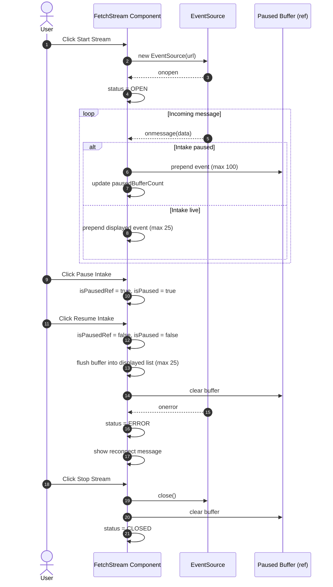

# Streaming Practice Guide

This note explains how the Wikimedia SSE practice component works so you can trace the full lifecycle while reading the code.

## What This Stream Is

- Transport: Server-Sent Events (SSE) via EventSource.
- Endpoint: https://stream.wikimedia.org/v2/stream/recentchange
- Rendering model: keep a bounded local list of recent events and show a filtered view.

## State and Buffers

The component keeps two event collections:

- Displayed events in React state.
- Paused buffer in a ref while intake is paused.

Important limits:

- Display list max size: 25 events.
- Paused buffer max size: 100 events.

## Lifecycle Walkthrough

### 1) Start Stream

When Start Stream is clicked:

1. Any existing stream is closed and pause-related buffers are reset.
2. Status changes to CONNECTING.
3. A new EventSource is opened.
4. onopen sets status to OPEN.
5. onmessage parses incoming JSON and either:
   - appends directly to displayed events, or
   - queues it in paused buffer when intake is paused.
6. onerror marks status ERROR and shows a reconnect message.

Why this matters:

- It demonstrates safe setup and teardown around browser streaming APIs.
- It also shows how to keep UI state resilient when transport errors happen.

### 2) Pause Intake

When Pause Intake is clicked:

1. A pause flag is set in both state and a ref.
2. Incoming messages continue arriving, but they are stored in paused buffer.
3. Displayed list does not change while paused.

Why both state and ref:

- State drives UI rendering.
- Ref is read synchronously by EventSource callbacks to avoid stale closure timing issues.

### 3) Resume Intake

When Resume Intake is clicked:

1. Pause flag is cleared in ref and state.
2. Buffered events are flushed into the displayed list.
3. The list is re-trimmed to the max event size.
4. Paused buffer count resets to zero.

Behavior detail:

- Buffered events are prepended so newest paused items appear first, consistent with live mode.

### 4) Stop Stream

When Stop Stream is clicked:

1. Current EventSource is closed.
2. Pause flags and paused buffer are reset.
3. Status becomes CLOSED (unless stream was still IDLE).

Note:

- Stopping does not erase displayed history. Use Clear Events for that.

### 5) Clear Events

When Clear Events is clicked:

1. Displayed events are cleared.
2. Paused buffer is also cleared.

## Lifecycle Diagram

## Filtering Pipeline

Three filters are applied against the displayed events:

- Wiki filter
- Event type filter
- Actor filter (all, human, bot)

The list shown on screen is filteredEvents, while counters show both:

- Showing X of Y events
- X is filtered count, Y is total displayed count.

## Parse and Safety Behavior

Incoming messages are validated before rendering:

- If required fields are missing, event is ignored.
- If JSON parse fails, event is ignored.
- Article URL is built only when title and server_url are present.

This pattern keeps malformed messages from breaking UI state.

## Related Test Coverage

Tests verify key behaviors with a mocked EventSource:

- Basic UI render.
- Wiki/type/actor filtering.
- Pause buffering and resume flush.
- Error message and status transition.

## Suggested Practice Exercises

1. Lower max displayed events to 5 and observe trimming behavior.
2. Emit malformed payloads in tests and verify they are ignored.
3. Add a reconnect-attempt counter in UI and test it.
4. Add a new filter for a specific user and test combinations.
